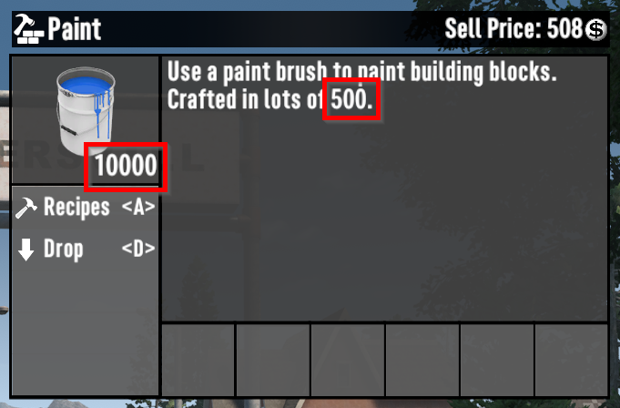
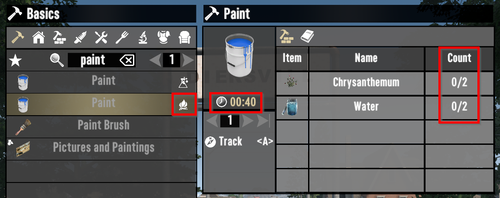
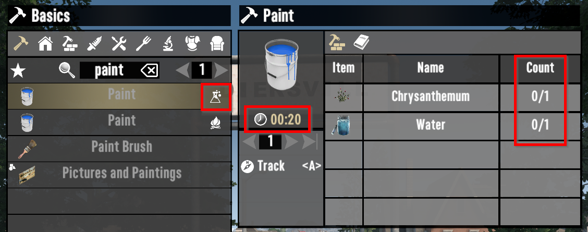

# ISI Better Painting

Makes painting better - better brushes, paint stacks higher, and makes it more obvious that crafting paint on the Chemistry Station is faster and cheaper.

## Brush

Increased the Range, Speed, and Precision of the normal Paint Brush to match the "Dev: Paint Brush". However, unlike the "Dev: Paint Brush" this brush still requires paint.

## Stacks

Paint now stacks to 10,000 instead of 1,000. This prevents needing to babysit the output slots on the Chemistry Station and Campfire when you need more than a lick of paint.

## Recipes

Increased the amount of paint the Campfire produces per lot to match the Chemistry Station. Increased the ingredient cost to maintain the ratio (the campfire *still* takes 40 seconds, 2 chrysanthemum, and 2 water to produce 500 units of paint).

This change just makes it more obvious in-game that the Chemistry Station produces paint two times faster and cheaper than the Campfire.

## Screenshots

